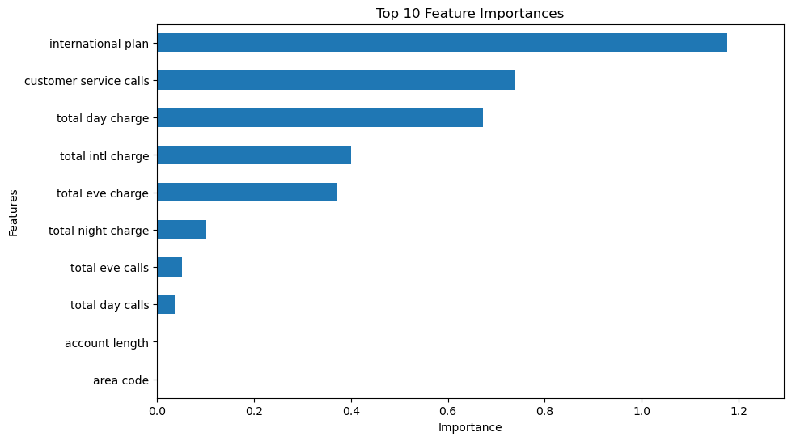
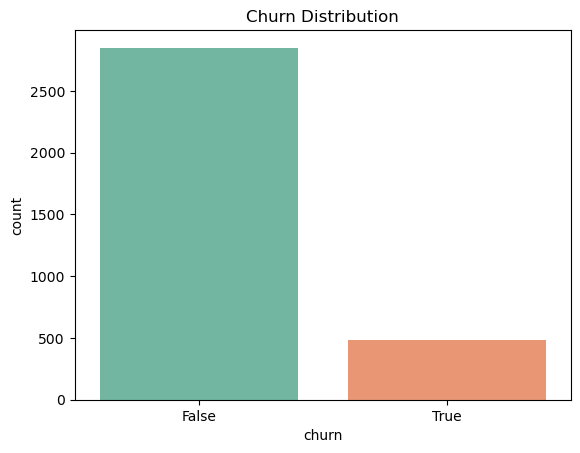
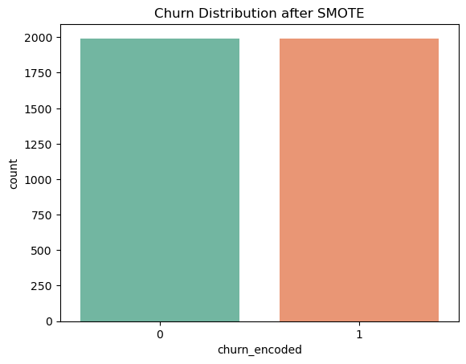
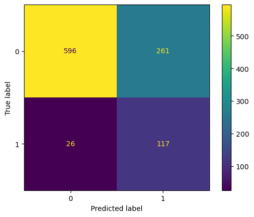
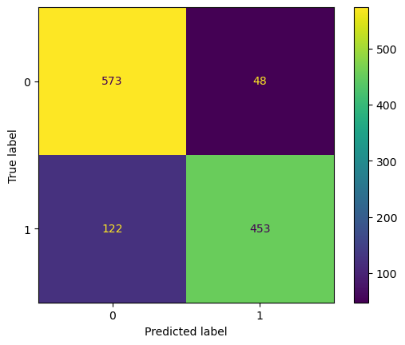

# SyriaTel Customer Churn Prediction Project
## 1. Overview
This project uses machine learning algorithms to predict customers behaviors and also predicts the probability of which customers are more likely to churn(i.e,leave the service provider). In this project, we will use the Telco Customer Churn dataset from kaggle inorder to build a predictive model.The dataset contains **3333 records** and has **20 predictors** such as customer service calls, voice mail plans, monthlycharges, etc. The predictors will helps us learn about the customers behaviors that may result in them churning. The target variable is the customer 'churn' which tells whether a customer left the company or is still a customer. 
## 2. Business and Data Understanding
### 2.1 Business Understanding
Telecommunication companies have several business challenges but customer churning is one of the most significant challenge. Mostly its always easier and economical to retain existing customers than acquire new ones. Currently **SyriaTel** is struggling with discountinuation of services by clients for unknown reasons. Mostly, customers churn due to various reasons such as negative customer relations, better offers from other service providers, dissaticfaction with the prices and not seeing value for their money, among other reasons.The main aim of this project is to help SyriaTel in mitigating customer churn by deriving insights from analysis of the data and building a predictive model. The company can retain customers by understanding their behavior and taking decisive steps to reduce identified churn risk. The objectives of this project are as follows:
 - Build a model to predict churn probability based on their usage of services among other parameters.
 - Identify the key causes of churn.
 - Segment high-risk customers.
 - Improve customer retention by coming up with clear business recommendations.
### 2.2 Stakeholders
 - Customer Service Team: To know how they improve service and improve customer satisfaction.
 - Marketing Department: Use the model to tailor offers,discounts and tarrifs targeted to high risk customers.
 - Customer Retention Department: Needs actionable information and recommendations to maintain customers and reduce churn.
 - Data Scientists: Maintaining and improving the model performance overtime and also monitor its performance.
### 2.3 Data Understanding
The dataset contains **3333 records** and has **20 predictors** plus 1 as the target variable. The most useful predictors in our analysis and the importance of each predictors are as follows:
 - **International Plan**: Whether the customer has an international subscription or not.
 - **Voice Mail Plan**: Whether the customer uses voice mail service or not.
 - **Day/eve/night/intl_mins/calls/charge**: Usage metrics.
 - **Customer Service Calls**: Number of calls a customer has made to customer service.
 - **Churn**: Our target Variable,(True if a customer churned,False if a customer is still using the service)
 
 Initial data exploration showed that:
  - Churn was imbalanced
  
  - International plan, Customer service calls and total day charge has a big relationship with churn.
### 2.3.1 Data preparation
  1. **Missing values**: The dataset had no missing values.
  2. **Encoding**: Encoded categorical variables(international plan,voicemail and Churn) using label encorder.
  3. **Class Imbalance**: Applied SMOTE(Synthetic Minority Over-sampling Technique) to balance our target variable.
  
  4. **Multicollinearity**: Dropped highly correlated numerical features(corr>0.75) to prevent overfiting.
  5. **Scaling**: Used standardscaler on numerical features for consistency.
### 2.3.2 Key insights
  - Customers who make more than three calls to customers service are more likely to churn.
  - Customers who has international plans have a significantly higher churn rate.
  - Voice mail plan had a negligible impact on churn.
  - Daytime charges is more predictive than night usage.
  - Correlation and p-values were used to quantify relationships.
## 3. Model Building
Models used:
  - Logistic Regression: Used as our baseline model.Its simple,fast and interpretable.Its also ideal for binary classification.
  - Decision Tree Classifier: Chosen because of its ability to handle non-linear relationships. Its also easy for non-technical stakeholders,making it useful for business decision making. It also performance better than the baseline model on recall which is important for identify churn.
Combining this two models allowed us evaluate the performance putting into account accuracy,interpretability and recall ensuring both quality predictions and meeting the business objectives.
## 4. Evaluation
Evaluation metrics:
  - Accuracy
  - Precison
  - Recall
  - F1-score
  - Confusion Matrix
  
  
  - ROC-AUC Score
Decison Tree Classifier performed better on recall capturing more churners, while Logistic Regression had a higher precision.
## 5. Findings and Conclusion
  - Customer service call being the most significant predictor indicated that churn probability increases after the third call.
  - Customers with an international plan are more likely to churn.
  - Total day usage correlated with churn indicating dissatisfaction with the service or probably overbilling during the day hours.
## 6. Recommendations
1.**International plan monitoring**
   - The company shound conduct and review the call quality,prices and the hidden charges that are associated to the international plan. Since most churners fall in this category,the company can tailor  personalized international bundles or give existing ones at a dicounted price.There should also be transparency in billing.
   - Surveys also should be conducted targetting the international users to get important feedbacks that can be used to curb churning.

2.**Customer Service Experience**
  
  The more a customer calls the service line,they more likely they are to churn. This can indicate dissatisfaction with the services or simply frustration.This can be solved by:
   - Proper training to the customer care assistants to improve response and the speed at which they handle issues as they arise.
   - Track repeat callers and forward their issues to more specialized team for speedy resolution,
   - Introduce self-service options like chatbots or FAQs to resolve issues that are mostly common.

3.**Pricing for Daytime Usage**
  
  High total day charges and daytime minutes charge are one of the key drivers to churn. The following actions should be taken inorder to handle this:
   - Review daytime tariffs.Consider lowering costs for frequent users
   - Offer alerts to customers which inform then when they charges are about to reach a costly limit.
   - Have different plans for users that can suit each of their call habits.